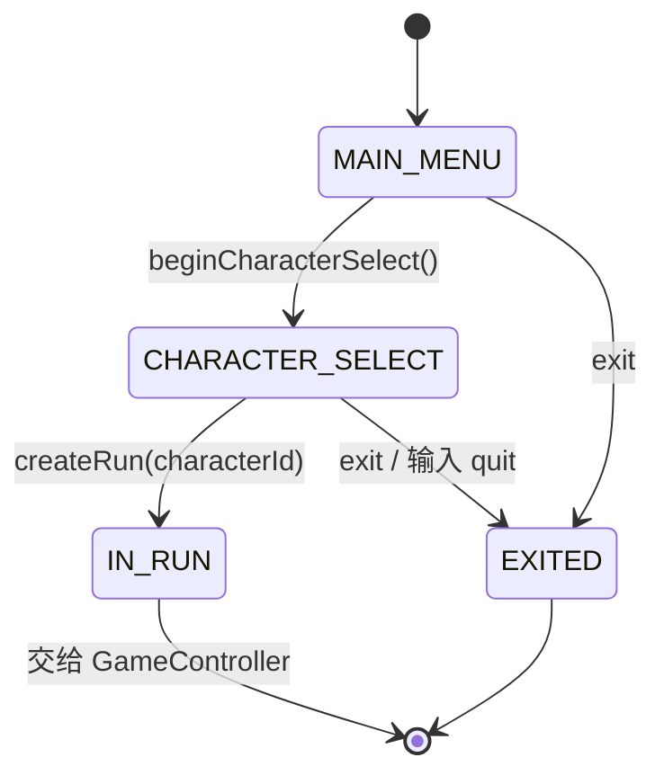
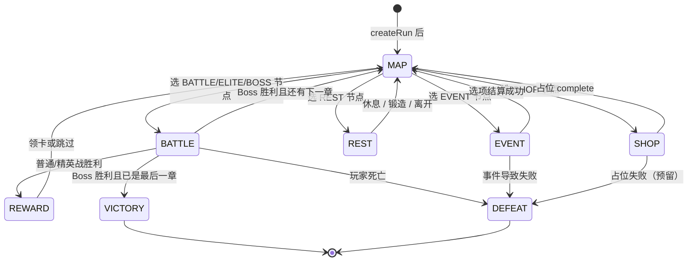
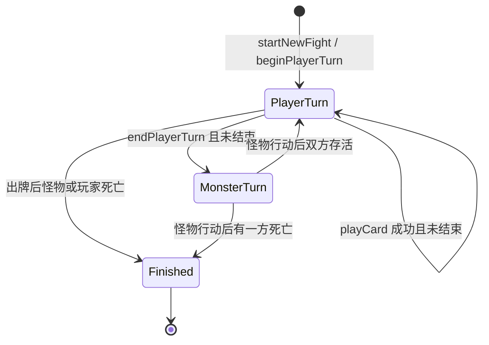
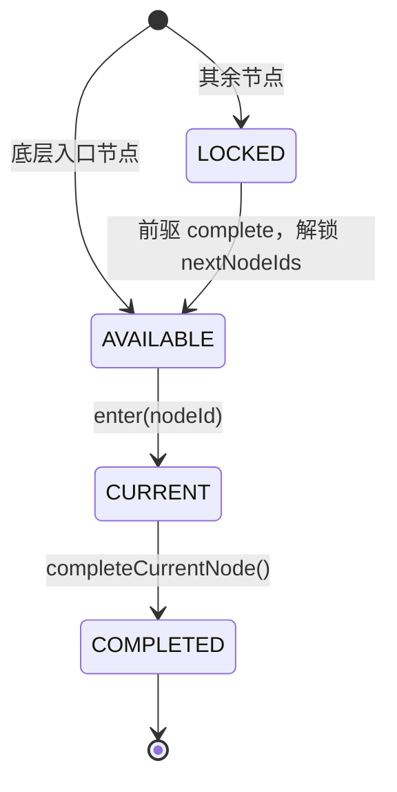

# 《Save The Spire》详细设计说明书（Day04 验收对照）

> 课程任务：详细设计与编码规范  
> 项目：类杀戮尖塔 · 2D 回合制卡牌（Java 21 后端权威）  
> 对应教案：`Day04-教案-详细设计与编码规范.md` 第五、六节  
> 对照代码：`com.roguelike.dungeon` 当前 `dev` 主干

本文同时完成两件事：

1. 按作业任务写出本项目的状态机、方法级设计、骨架运行与 AI 核对说明。  
2. 按教师评审表逐条对照现状，标出已满足项与已知缺口。

---

## 0. 验收对照总表

### 0.1 学生项目工作任务

| 任务 | 要求 | 本项目落点 | 状态 |
| --- | --- | --- | --- |
| 1 | 主流程状态机 + 至少一个子状态机，及状态转移表 | 本文第 1 节：`MenuPhase` / `GamePhase`（主）+ 战斗回合、地图节点（子） | 已完成 |
| 2 | 核心类方法签名、参数/返回值、前/后置条件、设计落点 | 本文第 2 节：`MenuController`、`GameController`、`Combat` | 已完成 |
| 3 | AI 生成 1~2 个核心方法，人工核对并补注释后提交 | 本文第 5 节：`Combat.playCard` / `endPlayerTurn` 拆分与核对记录 | 已完成 |
| 4 | 核心骨架可运行：界面可显示、主循环可运转、状态可切换 | `GameFlowDebugMain` 文字主循环；`App` JavaFX 战斗界面；HTTP 战斗接口 | 已完成 |
| 5 | 《详细设计说明书》（含 AI 使用与核对） | 本文 | 已完成 |

**完成标准对照**

| 标准 | 对照结论 |
| --- | --- |
| 状态机无死状态 | 菜单终态 `EXITED`、局内终态 `VICTORY`/`DEFEAT` 可进入且不再转出；其余状态均有退出边。见 1.5。 |
| 设计落点合理 | 拆分来自真实职责（上帝类 `Combat`、卡牌/实体边界），不是为了套写法。见 2.5。 |
| 骨架可运行 | `GameFlowDebugMain` 可演示选角 → 地图 → 战斗/事件/休息 → 回地图；`App` 可演示出牌与结束回合。 |
| 提交信息规范 | 类/方法有中文 Javadoc；阶段用枚举，非法阶段抛 `IllegalStateException`。 |
| 界面线程无耗时计算 | 规则层同步、无 I/O 循环；HTTP 用单线程 executor，不在 UI 线程跑服务器。见第 4 节。 |
| AI 生成代码已核对且问题已修正 | 见第 5 节核对记录（循环依赖、测试用 999 伤害已收回等）。 |

### 0.2 教师评审标准

| 检查项 | 通过标准 | 本组证据 |
| --- | --- | --- |
| 状态机 | 状态与转移覆盖 PO 全部流程，无死状态 | 第 1 节覆盖选角、地图、战斗、奖励、事件、休息、商店占位、通关/失败 |
| 设计落点 | 合理，不存在为使用写法而增加的抽象 | `BattleState` 装数据、`CardPlayService` 出牌、`MonsterAi` 行动，均对应原 `Combat` 内聚块 |
| 骨架可运行 | 主循环与状态切换可演示通过 | 运行 `com.roguelike.dungeon.debug.GameFlowDebugMain` |
| 代码规范 | 首轮走查每人至少 1 个文件，问题记入记录 | 第 6 节走查 `GameController` / `Combat` / `App` |
| 线程纪律 | 界面线程中无耗时计算 | 第 4 节；禁止 `sleep`、网络、大循环在 JavaFX `setOnAction` 内 |
| AI 核对 | 有核对记录且问题已修正 | 第 5 节 |

**不通过红线（当天清零）**

- 空 `catch`：核心流程用明确异常类型，调试入口对 `NumberFormatException` 等给出提示后返回，不吞掉后继续错状态。  
- 界面线程耗时计算：`App` 的点击回调只调用 `Combat.playCard` / `endPlayerTurn` 后 `refreshView()`，无文件/网络/睡眠。

---

## 1. 状态机图与状态转移表

PO 主流程：选角色 → 地图选点 → 关卡（战斗 / 事件 / 休息 / 商店）→ 战斗胜则领奖或 Boss 结算 → 回地图或通关/失败。

代码里拆成两层，避免菜单状态和局内状态混在一个枚举里：

- 开局前：`MenuPhase`（`MenuController`）
- 开局后：`GamePhase`（`GameController`）

### 1.1 主状态机 A：开局菜单 `MenuPhase`



| 当前状态 | 触发 | 守卫（前置） | 下一状态 | 动作 |
| --- | --- | --- | --- | --- |
| MAIN_MENU | `beginCharacterSelect()` | 当前必须是 MAIN_MENU | CHARACTER_SELECT | 进入选角 |
| CHARACTER_SELECT | `selectCharacter(id)` | 阶段正确；`catalog.getById` 成功 | 仍为 CHARACTER_SELECT | 只校验，不开局 |
| CHARACTER_SELECT | `createRun(id, seed, acts)` | 阶段正确；角色存在 | IN_RUN | `RunFactory.createRun` |
| CHARACTER_SELECT | 输入 `quit` | — | EXITED | 调试入口退出 |
| 任意 | `exit()` | — | EXITED | 结束菜单 |

说明：`god` 不出现在 `getAvailableCharacters()`，但 `getById("god")` 可解锁测试角色。这是调试入口，不进入公开选角列表。

### 1.2 主状态机 B：局内流程 `GamePhase`



| 当前 | 触发 | 守卫 | 下一状态 | 副作用 |
| --- | --- | --- | --- | --- |
| MAP | `selectNode(id)` 且类型为战斗类 | `canEnter(id)` | BATTLE | `CombatFactory.createForNode` |
| MAP | `selectNode` 且 EVENT | 同上 | EVENT | `EventCatalog.openEvent` |
| MAP | `selectNode` 且 REST | 同上 | REST | `new CampfireService` |
| MAP | `selectNode` 且 SHOP | 同上 | SHOP | 仅切阶段（商店模块占位） |
| BATTLE | 战斗结束 `COMPLETED` 且非 Boss | 当前在 BATTLE | REWARD | 生成 `RewardService` |
| BATTLE | 战斗结束 `COMPLETED` 且 Boss | 还有下一章 | MAP | `advanceAct()` |
| BATTLE | 战斗结束 `COMPLETED` 且 Boss | 已是最后一章 | VICTORY | 通关 |
| BATTLE | 战斗结束 `DEFEATED` | — | DEFEAT | 不 complete 当前节点 |
| REWARD | `claimRewardCard` / `skipRewardCard` | 阶段为 REWARD | MAP | `completeCurrentNode` |
| EVENT/REST/SHOP | `onLevelFinished(COMPLETED)` | 阶段匹配 | MAP | 解锁后继节点 |
| EVENT/REST/SHOP | `onLevelFinished(DEFEATED)` | 阶段匹配 | DEFEAT | 不解锁后继 |

`VICTORY`、`DEFEAT` 为终态：调试主循环打印结算后结束，不再接受选点。

### 1.3 子状态机：单场战斗回合

战场内部不占用 `GamePhase`（HTTP 同步结束怪物回合，对外只暴露 `PLAYER_TURN` / 胜负码）。内部用 `BattleState.playerTurn` + `finished`。



| 当前 | 触发 | 守卫 | 下一 | 动作 |
| --- | --- | --- | --- | --- |
| 玩家回合 | `playCard` | `isPlayerTurn()`，能量足够，牌可打出 | 玩家回合或 Finished | `CardPlayService.play` → `checkFinished` |
| 玩家回合 | `endPlayerTurn` | `isPlayerTurn()` | 怪物回合 | 弃手牌 |
| 怪物回合 | AI `takeTurn` | 战斗未结束 | 玩家回合或 Finished | 攻击或叠甲，然后 `checkFinished` |
| 任意 | HP 归零 | `checkFinished` 首次 | Finished | `BattleEventBus.publishFinished` 只发一次 |

非法出牌不改状态，返回 `PlayCardResult`（能量不足、非玩家回合等）。

### 1.4 子状态机：地图节点 `MapNodeState`



| 当前 | 触发 | 守卫 | 下一 |
| --- | --- | --- | --- |
| AVAILABLE | `enter` | 没有正在进行的节点 | CURRENT |
| CURRENT | `completeCurrentNode` | `currentNodeId != null` | COMPLETED，后继变 AVAILABLE |
| LOCKED | — | 未解锁 | 保持 LOCKED |

失败（`DEFEATED`）不调用 `completeCurrentNode`，当前节点不会变成 COMPLETED。

### 1.5 无死状态说明

- 每个非终态至少有一条合法退出边（选点、出牌/结束回合、领奖、事件选项、篝火操作、商店 `complete`）。  
- 终态 `IN_RUN` 交给局内机；`EXITED` / `VICTORY` / `DEFEAT` 结束进程或停止输入，不要求再转出。  
- 非法操作抛异常或返回错误码，**不进入未定义状态**。  
- 已知产品缺口：`SHOP` 可进入、可退出，但商店买卖尚未实现，用占位 `complete` 走完转移，避免卡死。

---

## 2. 方法级设计

设计落点：界面 / HTTP / 调试入口只调流程门面；规则在 `game.*`；`Combat` 只调度回合。

### 2.1 `MenuController.createRun`

```text
RunState createRun(String characterId, long runSeed, int totalActs)
```

| 项 | 约定 |
| --- | --- |
| 参数 | `characterId` 角色编号；`runSeed` 本局种子；`totalActs` 章节数 ≥ 1 |
| 返回 | 权威 `RunState`（玩家、永久牌组、地图） |
| 前置 | `phase == CHARACTER_SELECT`；目录中存在该角色（含隐藏 `god`） |
| 后置 | `phase == IN_RUN`；玩家生命=角色最大生命；牌组实例 id 唯一 |
| 异常 | 阶段不对 → `IllegalStateException`；未知角色 → `IllegalArgumentException` |
| 落点 | 开局组装放在 `RunFactory`，菜单类不 `new Player` 散落各处 |

### 2.2 `GameController.selectNode`

```text
MapNode selectNode(int nodeId)
```

| 项 | 约定 |
| --- | --- |
| 参数 | 地图节点编号 |
| 返回 | 进入的 `MapNode` |
| 前置 | `phase == MAP`；`MapProgress.canEnter(nodeId)` |
| 后置 | 按 `MapNodeType` 进入 BATTLE / EVENT / REST / SHOP；节点状态为 CURRENT |
| 异常 | 非 MAP 或不可进入 → `IllegalStateException` / `IllegalArgumentException` |
| 落点 | 地图进度与关卡启动的唯一入口，避免 UI 直接 `new Combat` |

### 2.3 `GameController.onLevelFinished`

```text
void onLevelFinished(LevelResult result)
```

| 项 | 约定 |
| --- | --- |
| 参数 | `COMPLETED` 或 `DEFEATED` |
| 前置 | 当前为 BATTLE / EVENT / SHOP / REST |
| 后置 | 失败 → DEFEAT；战斗胜利 → REWARD 或通关/下一章；非战斗成功 → MAP 且节点 COMPLETED |
| 落点 | 战斗不直接改地图，只通过 `LevelFinishHandler` 上报，避免循环依赖 |

### 2.4 `Combat.playCard` / `endPlayerTurn`

```text
PlayCardResult playCard(int handIndex)
PlayCardResult playCard(String cardInstanceId)
PlayCardResult playCard(String cardInstanceId, String targetCardId)
void endPlayerTurn()
```

| 方法 | 前置 | 后置（成功） | 失败行为 |
| --- | --- | --- | --- |
| `playCard` | 玩家回合且未结束 | 扣费、执行效果、牌进弃牌或消耗堆；可能结束战斗 | 返回枚举，不扣费、不移牌 |
| `endPlayerTurn` | `isPlayerTurn()` | 弃手牌 → 怪物行动 → 若未结束则新回合抽牌、能量回满、清玩家护甲后结算能力 | 非玩家回合直接 return |

`playCard` 内部只委托 `CardPlayService`，胜负仍由 `Combat.checkFinished` 判定。这是拆上帝类后的落点：出牌规则可单测，不必启动完整 `Combat`。

### 2.5 设计落点（对应「不为写法而抽象」）

| 类型 | 为何存在 | 若删除会怎样 |
| --- | --- | --- |
| `BattleState` | 战斗可变数据从 `Combat` 字段迁出 | 服务层只能反向依赖 `Combat` |
| `CardPlayService` | 出牌校验/扣费/移牌原是长方法 | `Combat` 再次膨胀 |
| `CardEffectContext` | 卡牌不能直接碰实体字段 | 每张新牌都改 `Combat` |
| `MonsterAi` | 不同怪物行动不同 | `runMonsterTurn` 里堆 `if` |
| `LevelFinishHandler` | 战斗模块不引用 `GameController` | `game.battle` 依赖 `flow` 实现类 |

没有引入无调用方的接口，也没有仅为「看起来像 DDD」而建的空仓库层。

---

## 3. 骨架运行与演示路径

### 3.1 文字主循环（推荐课堂演示）

入口：`com.roguelike.dungeon.debug.GameFlowDebugMain`

```
选角（MenuPhase）
  → 打印地图（GamePhase.MAP）
  → 输入节点编号（状态切换）
  → 战斗：play / end；事件：选项；休息：rest/smith/leave；商店：complete
  → 回 MAP 或 VICTORY / DEFEAT
```

界面可显示：控制台打印 HP、金币、地图 ASCII、手牌与意图。  
主循环可运转：`while (running) switch (getPhase())`。  
状态可切换：`selectNode` / `onLevelFinished` / 奖励与篝火 API。

### 3.2 JavaFX 战斗界面

入口：`com.roguelike.dungeon.Launcher` 或 `mvnw javafx:run`。  
展示血量、护甲、能量、手牌按钮、结束回合。用于演示**战斗子状态机**，不覆盖整张地图。

### 3.3 HTTP（可选）

`BattleServer` 将 `Combat` 暴露为 `/api/v1/battles`。请求在**单线程线程池**串行执行，不占用 JavaFX 线程。

---

## 4. 线程纪律

| 线程 | 允许做什么 | 不允许做什么 |
| --- | --- | --- |
| JavaFX Application Thread | 读 `Combat` getter、调用 `playCard`/`endPlayerTurn`、刷新控件 | 读文件、HTTP、`Thread.sleep`、洗超大牌堆循环以外的重计算 |
| HTTP executor（单线程） | 创建/推进 `Combat`、序列化 JSON | 再派回 JavaFX |
| 控制台主线程 | `GameFlowDebugMain` 同步读输入并调 `GameController` | 无并行战斗状态 |

回合制一步计算量小（一张牌效果、一次 AI），同步调用可接受。若以后有生成整图或大量随机，应放到后台线程，结果再用 `Platform.runLater` 刷新。

当前 `App.setOnAction` 中无耗时 I/O，满足「界面线程中无耗时计算」。

---

## 5. AI 使用与核对说明（任务 3 / 评审「AI 核对」）

### 5.1 使用范围

使用 Cursor 辅助完成的片段（示例，非全部历史）：

1. 将上帝类 `Combat` 拆为 `BattleState`、`BattleEventBus`、`CardPlayService`、`MonsterAiService`、`CombatFactory`。  
2. 卡牌「献身打击」改为「御血术」数值。  
3. 隐藏测试角色 `god` + 卡牌「降神」。

未把生成结果直接当最终稿：每次改动后跑 `mvn test`，并对照既有规则（能量不足整次失败、护甲先于血量、结束通知只发一次）。

### 5.2 核心方法核对：`Combat.playCard`

AI 初稿倾向让 `CardPlayService` 返回 `Combat.PlayCardResult` 内部枚举，会造成 `CardPlayService → Combat → CardPlayService` 循环依赖。

**人工修正：** 将枚举提升为顶层 `PlayCardResult`；`Combat.playCard` 只在 `SUCCESS` 后 `checkFinished()`。  
**注释：** 类与方法 Javadoc 写明「不判定胜负、下层不引用 Combat」。

### 5.3 核心方法核对：`Combat.endPlayerTurn`

AI 可能把日志、AI、抽牌写回一个超长方法。

**人工保持：** 弃牌与日志留在调度器；行动委托 `monsterAi.takeTurn(state)`；清甲后再结算能力（金属化），避免刚加的护甲被立刻清空。  
**验证：** `CardEffectTest.metallicizeGrantsBlockAtStartOfNextTurn`。

### 5.4 已修正问题清单

| 问题 | 来源 | 修正 |
| --- | --- | --- |
| 下层服务引用 `Combat` | 拆分初稿 | 抽出 `PlayCardResult`、伤害写在 `BattleState` |
| 测试把「打击」改成 999 伤 | 临时调试 | 已改回 6/9；秒杀改到隐藏角色「降神」 |
| `CombatCardEffectContext` 持有 `Combat` | 旧适配器 | 改为只依赖 `BattleState` 与回调 |
| 商店无退出边（潜在死状态） | 模块未做完 | 调试入口 `complete` → `onLevelFinished(COMPLETED)` |

### 5.5 提交时建议附上的核对声明（可复制）

> 本提交中战斗调度与出牌路径有 AI 辅助生成。已人工核对立方：无循环依赖、能量不足无副作用、护甲结算顺序、结束事件只发布一次。相关单测：`CombatTest`、`CardPlayServiceTest`、`GameControllerTest`、`CharacterCatalogTest`。

---

## 6. 代码走查记录（评审「代码规范」）

首轮走查文件（建议每人认领 1 个）：

| 文件 | 检查点 | 结论 |
| --- | --- | --- |
| `flow/GameController.java` | 阶段守卫、`selectNode` 穷尽节点类型、失败不 complete 节点 | 通过；SHOP 仅切阶段，有占位退出 |
| `game/battle/Combat.java` | 出牌失败不改状态；`checkFinished` 只通知一次 | 通过（经 `BattleEventBus`） |
| `App.java` | 点击回调无 sleep/网络 | 通过 |

走查问题（已处理或记为已知）：

1. ~~打击 999 污染正式数值~~ 已改回。  
2. 商店买卖未实现：用占位完成状态转移，不作为死状态，但功能不完整，后续迭代。

未发现空 `catch` 吞掉业务异常后继续推进阶段的情况。

---

## 7. 包结构与职责（便于评委对照代码）

```
com.roguelike.dungeon
  flow/          菜单与局内阶段（GameController、MenuController）
  game/run/      跨关卡权威状态 RunState
  game/map/      地图生成与进度
  game/battle/   战斗调度与出牌/AI
  game/card/     卡牌定义与效果接口
  game/entity/   Player / Enemy / 能力 / 状态
  game/character 角色目录
  ui/ / debug/ / http/   展示与调试，不拥有规则
```

依赖方向：UI/HTTP → `flow` → `game.*`。`game.battle` 不依赖 JavaFX。

---

## 8. 演示检查清单（课堂）

1. 运行 `GameFlowDebugMain`，选 `blood`，地图出现，输入可达节点编号，`getPhase()` 变化。  
2. 战斗中 `play 0` 扣能量，`end` 后怪物行动，回到玩家回合。  
3. 普通战斗胜利进入奖励，`skip` 后回到地图。  
4. 输入非法节点编号只提示错误，阶段仍为 MAP。  
5. （可选）选角输入 `god`，手牌仅「降神」，用于快速打通战斗子流程。

以上覆盖「主循环可运转、状态可切换、无死状态卡死」。
